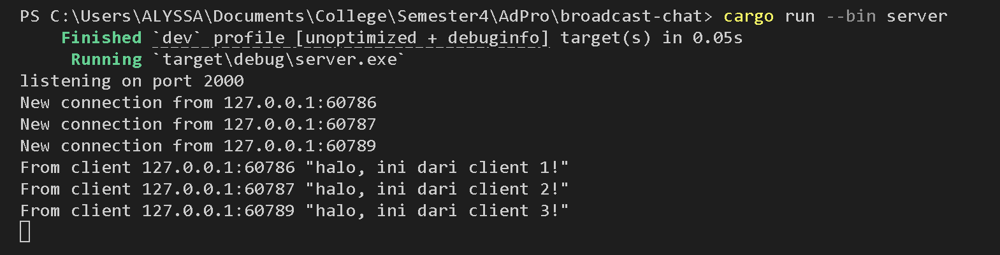
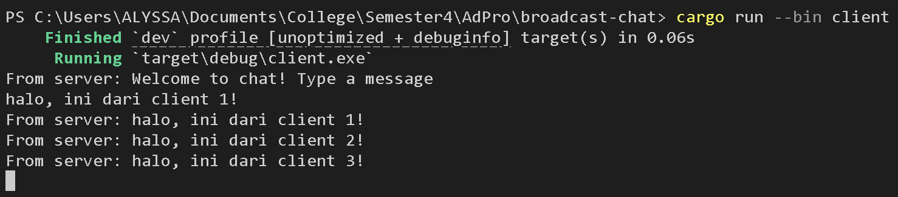
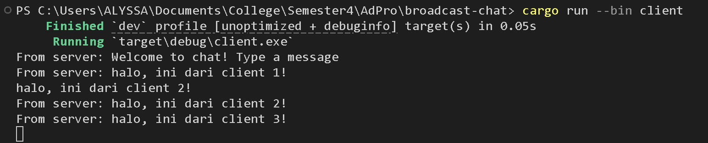
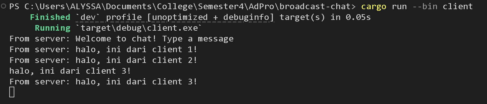
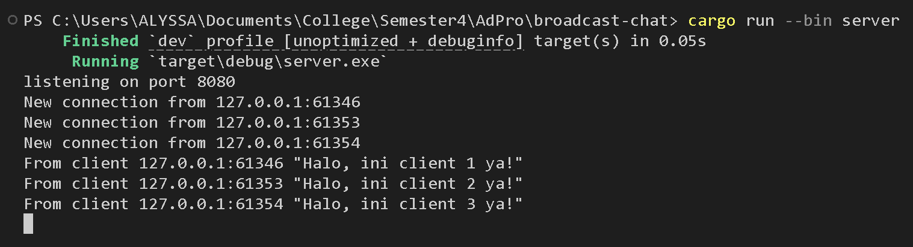
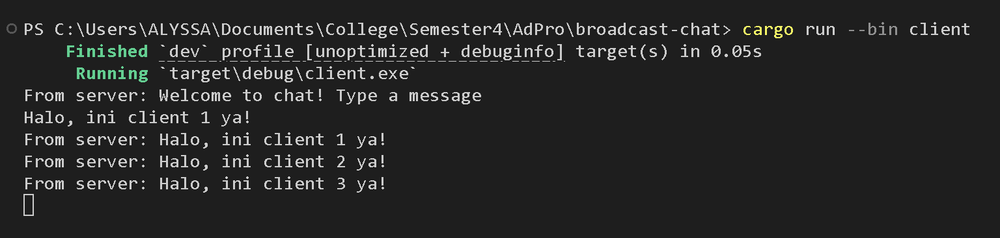
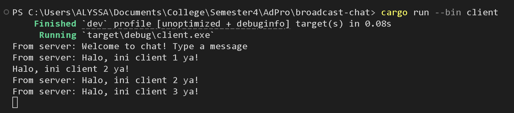
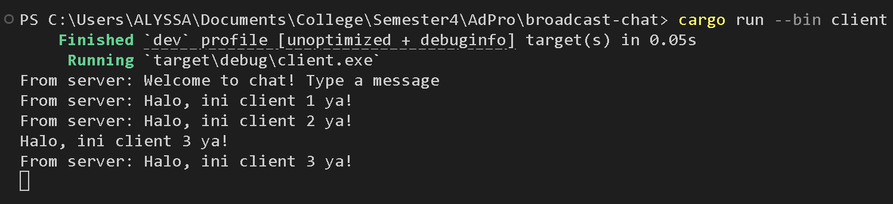
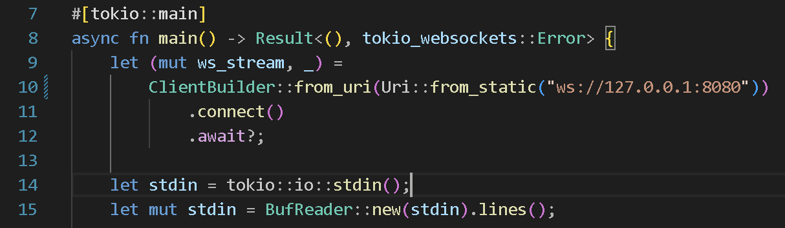
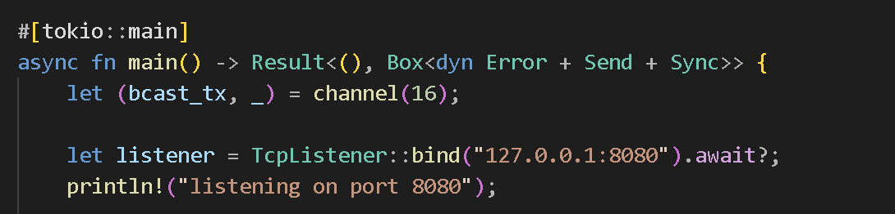

**Nama**: Alyssa Layla Sasti    
**Kelas**: AdPro B   
**NPM**: 2306152052  

# REFLECTION MODULE 10 BROADCAST-CHAT
## 2.1 Original code of broadcast chat
- Server

- Client 1

- Client 2

- Client 3

1. Bagaimana cara run server?  
Jalankan command `cargo run --bin server`
2. Bagimana cara run 3 client?  
Jalankan command `cargo run --bin client` pada 3 terminal berbeda
3. What happens when you type some text in the clients.  
Ketika menjalankan server, server akan terconnect atau listening kepada request yang masuk di port 2000. Terlihat ketika client 1, client 2, dan client 3 connect, pada server akan muncul "New connection from ...(port berapa). Kemudian pada setiap terminal client akan ada "From server:..." Menandakan client sudah terconnect dengan server. Dengan begitu semua server dan client akan terhubung satu sama lain. Server akan mendapat semua pesan yang dikirimkan masing - masing clientnya. Kemudian pesan dari satu client akan didapatkan oleh client-client yang lain via server.

## 2.2 Original code of broadcast chat
- Server

- Client 1

- Client 2

- Client 3

- Kode yang diubah di client.rs

- Kode yang diubah di server.rs

1. Apa yang dimodifikasi?  
Saya memodifikasi komunikasi antara server dan client dari port 2000 ke 8080. Saya memodifikasi portnya di client.rs dan server.rs karena menggunakan WebSocket protocol di sisi client sehingga harus reference ke port yang sama untuk dapat berkomunikasi dengan baik. Kemudian di sisi server menggunakan TcPListener yang merefer ke port yang sama yaitu 8080. Selain itu kinerja dan alur komunikasi antara server dan client sama seperti pada 2.1